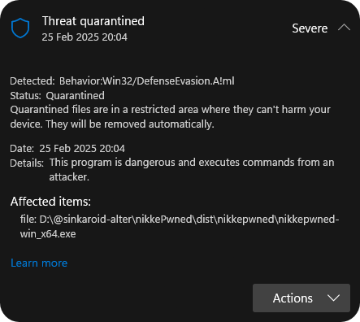

## Prevent Windows Defender from Flagging the Tool  

  

Example If Windows Defender flags this tool as a malware, follow these steps to exclude it from scans:  

1. **Press** `Win + R`, type `windowsdefender://exclusions`, and press **Enter**.  
2. Click **"Add an exclusion"** and select **"Folder"**.  
3. Choose the folder where this tool is located.  

This prevents Defender from falsely detecting it as a malware, You can adjust it to your trusted antivirus programs  

## This Tool Flagged as Potential Malware
Security software may flag this tool as **potential malware** because:

- It uses `Neutralino.os.execCommand` to execute PowerShell commands.
- The PowerShell script automates keyboard input via `[System.Windows.Forms.SendKeys]::SendWait`, which can mimic user interactions.
- Automation of login fields (`{TAB}${emailFixed}{TAB}${passwordFixed}{ENTER}`) can resemble credential stuffing or unauthorized access attempts.
- Some antivirus programs consider any script that interacts with login forms as a potential keylogger or credential harvesting attempt.
- **Screenshot Capture Consideration:** If the tool includes functionality to capture screenshots, it may be flagged as spyware or screen-grabbing malware.
- **Behavioral Detection:** Windows Defender or other security tools may classify this tool under `Behavior:Win32/DefenseEvasion` due to its ability to bypass security policies, automate UI actions, or obfuscate execution patterns.

### Intended Use
This tool is designed **exclusively** for **automated login purposes** to streamline authentication processes, **not for malicious attacks or unauthorized access**.

### Mitigation & Trust Assurance
To ensure the safe and legitimate use of this tool, the following measures have been implemented:

- **Verified Usage**: This tool is designed with transparency in mind, ensuring it is only used for authorized automated logins.
- **Secure Deployment**: Users are encouraged to run the tool in a controlled and trusted environment to prevent unauthorized access.
- **Data Protection**: Sensitive credentials are never stored in plaintext and should be managed using secure storage mechanisms.
- **Ethical Development**: The tool follows ethical automation practices and is not intended for misuse or unauthorized access.
- **User Control**: All operations are performed with user consent, and no hidden activities are executed in the background.
- **Compliance**: Users should ensure compliance with their organization's security policies and guidelines when using this tool.

If flagged by security software, users are advised to review their security policies, whitelist the tool where appropriate, and configure trusted execution settings to prevent false positives.
