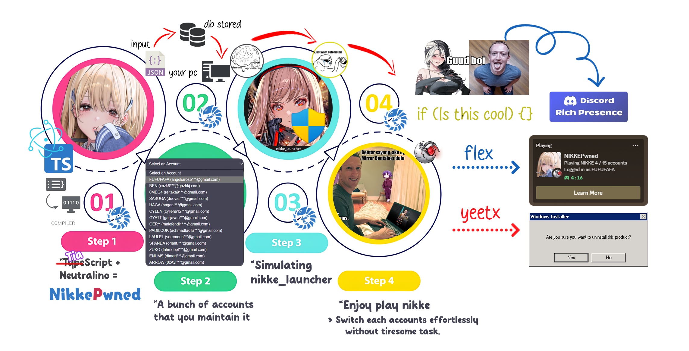
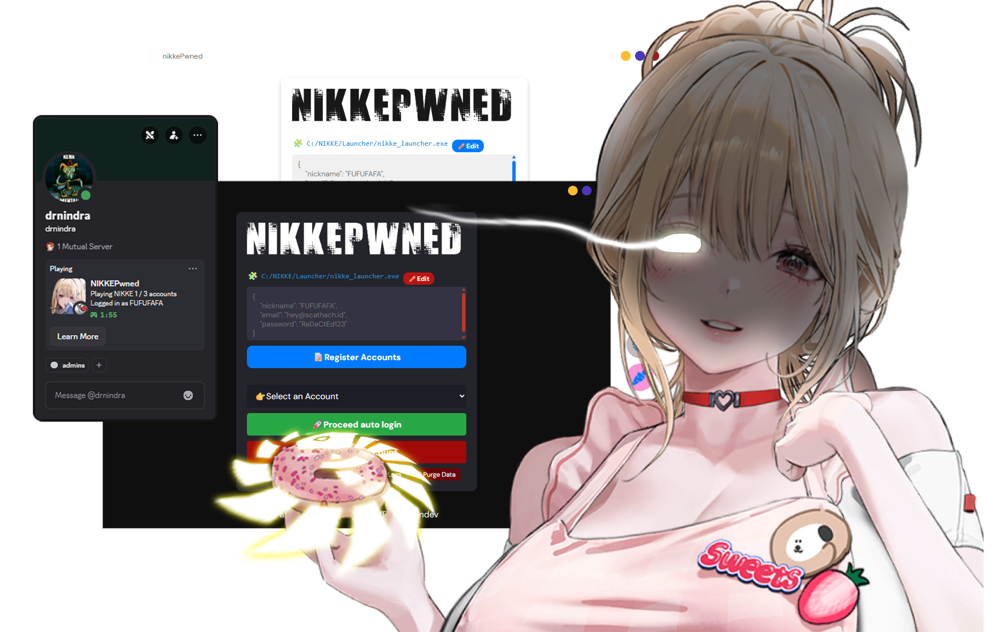
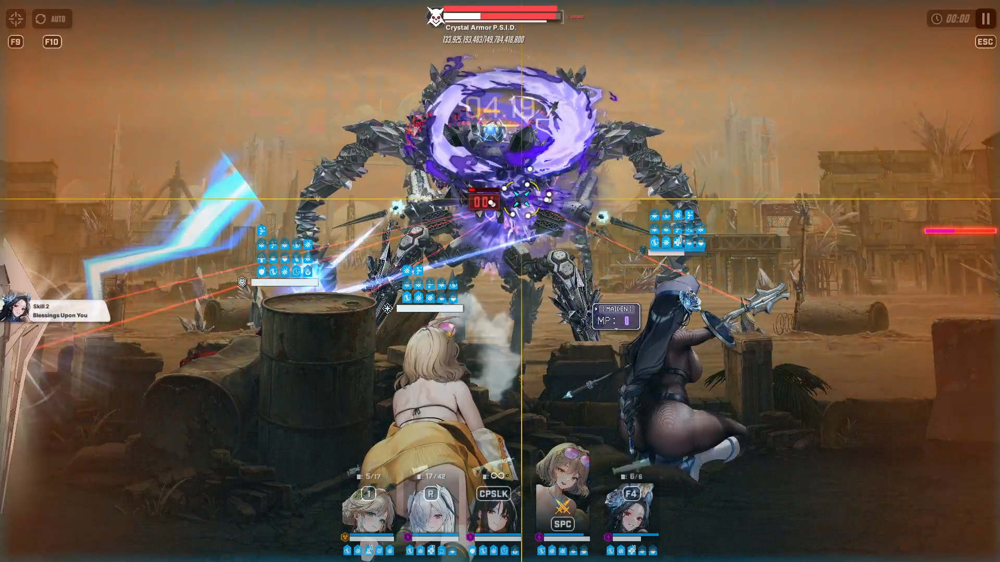
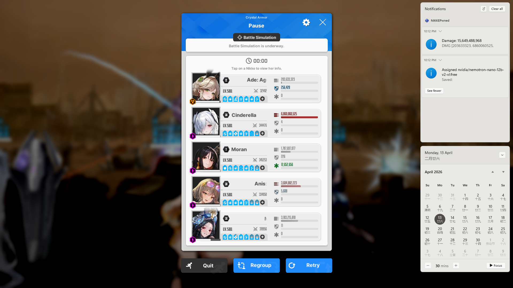
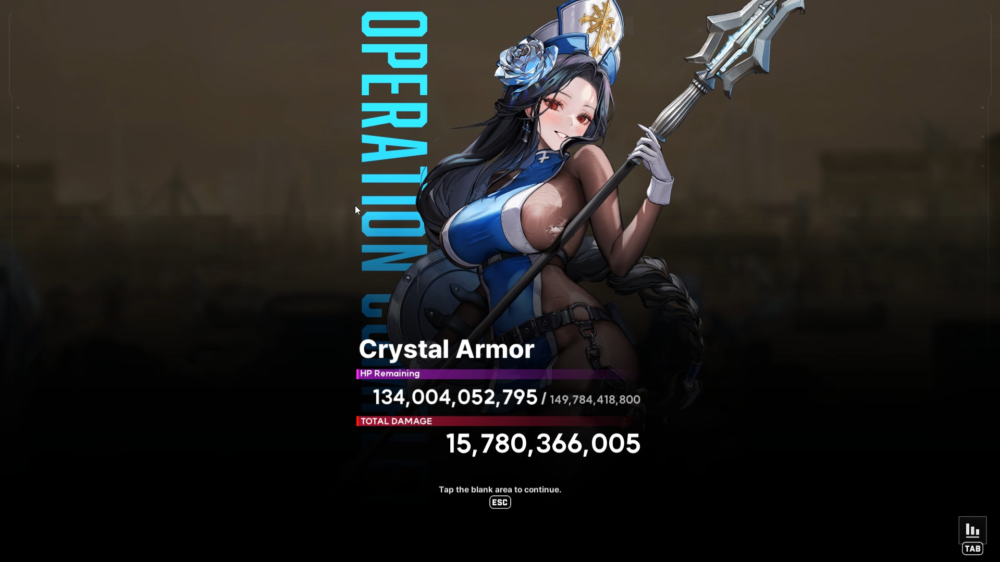

<div align="center">
<a href="#"></a>


<p align="center">
	<a href="https://github.com/ScathachGrip/nikkePwned/actions/workflows/build.yml"></a>
	<a href="https://github.com/ScathachGrip/nikkePwned/actions/workflows/build-rpc.yml"></a>
</p>

NIKKEPwned is a Password Manager for NIKKE, it uses localStorage and simulating nikke_launcher  
The motivation of this project is simplified login process, allowing users interacts each accounts **quickly and effortlessly**. Thanks to [@neutralinojs/neutralinojs](https://github.com/neutralinojs/neutralinojs) for its streamlined JS/TS bindings.

<a href="#installation">Installation</a> •
<a href="https://github.com/ScathachGrip/nikkePwned/blob/master/CONTRIBUTING.md">Contributing</a> •
<a href="https://github.com/ScathachGrip/nikkePwned/issues/new/choose">Report Issues</a>
</div>

---

- [NIKKEPwned](#)
  - [The problem](#the-problem)
  - [The solution](#the-solution)
  - [Prerequisites](#prerequisites)
    - [Installation](#installation)
      - [How to interacts](#how-to-interacts)
        - [Core operations](#core-operations)
        - [Management & diagnostics](#management--diagnostics)
      - [Inputing data](#inputting-data)
      - [Discord RPC support](#discord-rpc-supports)
  - [Image reasoning for damageDealt check](#image-reasoning)
    - [Setup](#setup)
    - [Compatible vision models](#compatible-vision-models)
      - [PreCapture](#precapture)
      - [PausedState & AssignedResults](#pausedstate--assignedresults)
      - [ActualResult & Less hallucination](#actualresult--less-hallucination)
  - [Running tests](#running-tests)
    - [Manual build](#manual-build)
  - [Limitations](#Limitations)
    - [Prevent antivirus things](./LIMITATIONS.md#prevent-windows-defender-from-flagging-the-tool)
    - [Tool flagged as potential malware](./LIMITATIONS.md#this-tool-flagged-as-potential-malware)
  - [Application safety report](#application-safety-report)
  - [Pronunciation](#Pronunciation)
  - [Acknowledgements](./CLOSING_REMARKS.md)
  - [Legal](#legal)

# The Problem  
Managing multiple accounts can be frustrating and inefficient, especially when you need to **log in manually one by one**. For users who frequently switch between multiple accounts, constantly entering login information can be a repetitive and tiresome task.  

# The Solution  
  
This extension was designed to simplified login process, **automate the login process**, allowing users to log in to their accounts **quickly and effortlessly**. Instead copying pasting or manually typing credentials every time, this tool handles the process for you, **saving time and reducing errors**. By streamlining account management, this tool makes switching between accounts **seamless and efficient**, eliminating the hassle of repetitive logins. Whether you're managing a handful of accounts or dozens, this tool ensures a smoother, faster, and more convenient login experience.  

## Prerequisites
- `64-bit editions of Microsoft Windows 11 or Microsoft Windows 10`
  - `Other environments have not been tested; additional testing and feedback are welcome.`
- You should turn-off antivirus
  - You should do some exception things or exclusion 
    - (if your antivirus scanning this tool however)
  - Read more: [this tool flagged as potential malware](./LIMITATIONS.md#this-tool-flagged-as-potential-malware)

# Installation
- Get the latest build version from the [release page You only need nikkepwned-release.zip.](https://github.com/ScathachGrip/nikkePwned/releases) 
- Unzip it, or extract it "as folder" somewhere in your computer
- Open `nikkepwned-win_x64.exe` with **Run as Administrator**
  - Read more: [Limitations](#Limitations) for clearly explanation.  

# How to interacts
>  1. Edit launcher location where `nikke_launcher.exe` located, then select.
>  2. Input accounts as JSON
>  3. If success then select corresponding account
>  4. Proceed auto login
<table>
	<td><b>NOTE:</b> After nikke launcer opened and the automation runs,<br>
  You should depends on it, do not arbitrary clicks or tabs while login process still running.<br>
  Just wait until complete I added a small delays to avoid abuse and misleading usage.
</table>

## Discord RPC supports
Started from `4.0.1-indev`: this tools has automated created websocket connection to [Discord Rich Presence](https://docs.discord.com/developers/platform/rich-presence). If you willing to disable it check your task manager and kill it manual.

</a>

## Core Operations

| Feature | Description |
|--------|-------------|
| **Path Configuration** | Specifies the location of `nikke_launcher.exe` required for the tool to operate. |
| **JSON Input** | Allows entry of account credentials in JSON format. Refer to *Inputting Data* for details. |
| **Account Selection** | Provides a dropdown list of registered accounts for selection. |
| **Login Execution** | Initiates an automated login process by simulating `nikke_launcher` without requiring user interaction. |

---

## Management & Diagnostics

| Feature | Description |
|--------|-------------|
| **Account Removal** | Removes the selected account from the tool. |
| **Switch Delay** | Defines the delay between account switches. Default: `5` seconds (Range: `1–8` seconds). |
| **Login Delay** | Sets a delay before login attempts to prevent excessive requests. Default: `5` seconds (Range: `1–8` seconds). |
| **Activity Logs** | Displays operational logs, including login attempts, path updates, and delay configurations. |
| **Data Purge** | Permanently deletes all stored data within the tool. |
| **Click Test (Rapidfire)** | Performs rapid or double-click mouse input tests (macro validation). |

## Inputting data
This tool uses JSON and supports **two types of input** here's the example:

🟢 Single Input (Object Format)  
Use this format when inputting one by one account:  
```json
{
  "nickname": "FUFUFAFA",
  "email": "foobar1@gmail.com",
  "password": "asuasu123"
}
```

🔵 Multiple Input (Array Format)  
Use this format when inputting multiple accounts at once:
```json
[
  {
    "nickname": "FUFUFAFA",
    "email": "foobar1@gmail.com",
    "password": "asuasu123"
  },
  {
    "nickname": "FUCEKGIBRAN",
    "email": "foobar2@gmail.com",
    "password": "asuasu123"
  },
  {
    "nickname": "WHATEVER",
    "email": "foobar3+2@gmail.com",
    "password": "asuasu123"
  }
]
```
If there's an errors watch your step again then..  
- You should not change or rename the PROPERTY `nickname`, `email`, and `password`  
- You only supposed to change its VALUE


# Image Reasoning

Started from `4.0.1-indev`: this tool has image reasoning and consuming some LLMs.  

You probably don't wanna calculate it manually, and there's always inconsistency between mock battles and real battles (damage values differ — blame NIKKE though), especially in UnionRaid Hard mode which is tons of HP and where exact damage dealt values aren't displayed. NIKKEPwned handle it and check the total damage using image reasoning. It's quite simple: when the battle is about to end at 00:00 or 00:01, press `ESC` to pause and then assign `F8` before registering real damage to ensure accurate results.  

### PreCapture  
Battlefield screen at `00:01` or `00:00` before registering actual damage.




### PausedState & AssignedResults  
Press `ESC` to pause, then assign `F8` to perform image-reasoning and extract damage data. When assigned, You can make notification keep visible by pressing `Win + N`.



### ActualResult & Less Hallucination 
`nvidia/nemotron-nano-12b-v2-vl:free` is recommended based on internal tests. It demonstrates faster response times and more consistent accuracy. If everything working as expected you can continue to nikke and registering actual damage otherwise keep retry or regroup.  





---

## Setup

| Step | Description |
|------|-------------|
| `API Key` | Enter your OpenRouter API key to enable access to available models. |
| `Vision Models` | Default `nvidia/nemotron-nano-12b-v2-vl:free`. |
| `Save Configuration` | Save and apply the current configuration. |
| `Battlefield NIKKE` | Open a battlefield (vs-boss) NIKKE combat screen. |
| `Trigger Analysis` | Press `ESC` to pause, then press `F8` to initiate damage extraction. |
| `View Results` | Upon completion, access the results via Windows notifications (`Win + N`). |

## Compatible Vision Models

```js
const OPENROUTER_MODEL_POOL = [
  "nvidia/nemotron-nano-12b-v2-vl:free",
  "google/gemma-4-26b-a4b-it:free",
  "google/gemma-4-31b-it:free",
  "nvidia/nemotron-3-super-120b-a12b:free",
  "minimax/minimax-m2.5:free",
  "arcee-ai/trinity-large-preview:free",
  "liquid/lfm-2.5-1.2b-thinking:free",
  "liquid/lfm-2.5-1.2b-instruct:free",
  "nvidia/nemotron-3-nano-30b-a3b:free",
  "qwen/qwen3-next-80b-a3b-instruct:free",
  "nvidia/nemotron-nano-9b-v2:free",
  "openai/gpt-oss-120b:free",
  "openai/gpt-oss-20b:free",
  "z-ai/glm-4.5-air:free",
  "qwen/qwen3-coder:free",
  "cognitivecomputations/dolphin-mistral-24b-venice-edition:free",
  "google/gemma-3n-e2b-it:free",
  "google/gemma-3n-e4b-it:free",
  "google/gemma-3-4b-it:free",
  "google/gemma-3-12b-it:free",
  "google/gemma-3-27b-it:free",
  "meta-llama/llama-3.3-70b-instruct:free",
  "meta-llama/llama-3.2-3b-instruct:free",
  "nousresearch/hermes-3-llama-3.1-405b:free",
];
```

While multiple models are supported `nvidia/nemotron-nano-12b-v2-vl:free` is recommended based on internal testing. It demonstrates faster response times and more consistent accuracy, with reduced hallucination in image-based reasoning tasks.

## Running tests
> Check workflows and the whole build script on  `package.json`

## Manual build
<table>
	<td><b>NOTE:</b> NodeJS 20.x or higher</td>
</table>


If you prefer to build the project manually, follow these steps:  
```sh
git clone https://github.com/ScathachGrip/nikkePwned.git
cd nikkePwned
```
You can check build script on `package.json` for the step by step.

## Limitations
This tool must be `run as Administrator` to function correctly because:
- Simple, I just want to be automated.
- It **simulates keystrokes**, which requires elevated permissions.
- Opening NIKKE launcher triggers **User Account Control (UAC) prompt** otherwise the flow will broke

> Read more: [LIMITATIONS.md for clearly explanation.](./LIMITATIONS.md)


## Application Safety Report

**Security Notice**. For transparency, this application was analyzed by multiple third‑party scanning and sandboxing services. Detection engines may sometimes classify the binary as suspicious because it launches PowerShell commands through `<Neutralino.os.execCommand()>` and issues simulated keystrokes to interact with the UI (e.g., `[System.Windows.Forms.SendKeys]::SendWait`). These actions are implemented solely to automate legitimate user interactions (automated login for the NIKKE client) and not for credential harvesting, persistence, or remote access. Such automation patterns can match behavioral signatures used by endpoint protection products; therefore, if you encounter a positive detection, treat it as a potential false positive and consult the linked scan reports or contact the AV vendor for a formal false‑positive review.

- **[VirusTotal Scan Report](https://www.virustotal.com/gui/file/08bc7cb8491627835ea958595386e0d3007cc3a150f1c6d28f03739d4629e9c7)**
- **[Hybrid Analysis Report](https://hybrid-analysis.com/sample/08bc7cb8491627835ea958595386e0d3007cc3a150f1c6d28f03739d4629e9c7)**
- **[Jotti's Malware Scan Report](https://virusscan.jotti.org/en-US/filescanjob/x2zfdx6pqb)**
- **[MetaDefender Report](https://metadefender.com/results/file/bzI1MDkxOW5hbmtUNjA5NW5Id2hTWm9jZHNK_mdaas)**  

**Q: Is this safe?**  
> Yes, my code is fully transparent, I even write it with sweet and readable COMMENTS to make more casual or entry level can understand. You can check the source yourself—take a look at [app.ts](./src/app.ts) and [websocket.ts](./websocket.ts). There are no hidden scripts or anything suspicious.

**Q: I’m still unsure. Do I have to use it?**   
> I completely understand your concern. Here’s a simple way to decide:
- **You can** if you value simplicity and convenience.
- **Avoid it** ~~If you FOMO~~ if you security concerns outweigh your need for ease of use.

All code is transparently written and documented in this GitHub repository, with all binary bundles generated through GitHub CI (Continuous Integration). There are no hidden scripts or encrypted stuff. There would be no reason for me to do otherwise.

## Pronunciation
[`en_US`](https://www.localeplanet.com/java/en-US/index.html) • NYIKKE "powned" **/poʊnd/** */ or "pawned" (/pɔːnd/) — Both mean getting wrecked; "powned" rules gaming slang, while "pawned" sneaks in as an alt take.

## Legal
This tool can be freely copied, modified, altered, distributed without any attribution whatsoever. However, if you feel
like this tool deserves an attribution, mention it. It won't hurt anybody.
> Licence: WTF.
