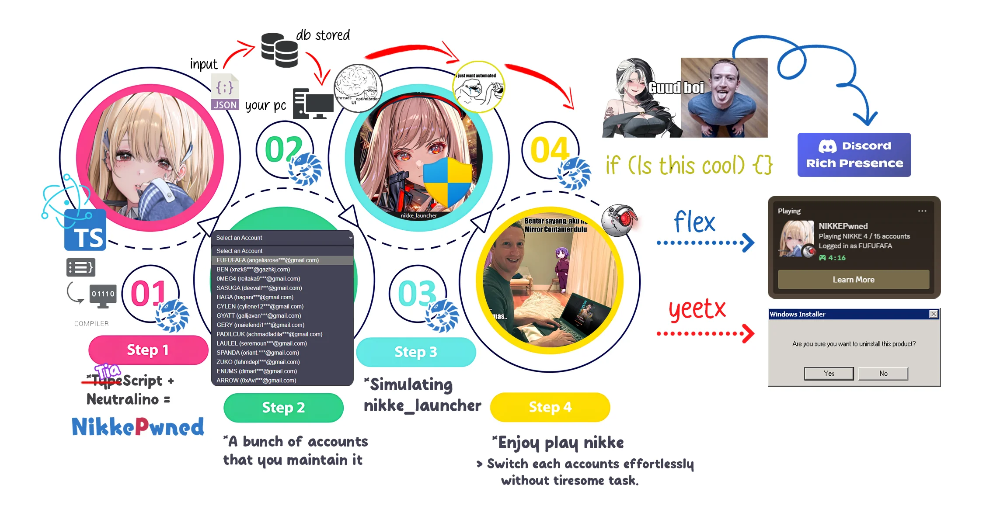
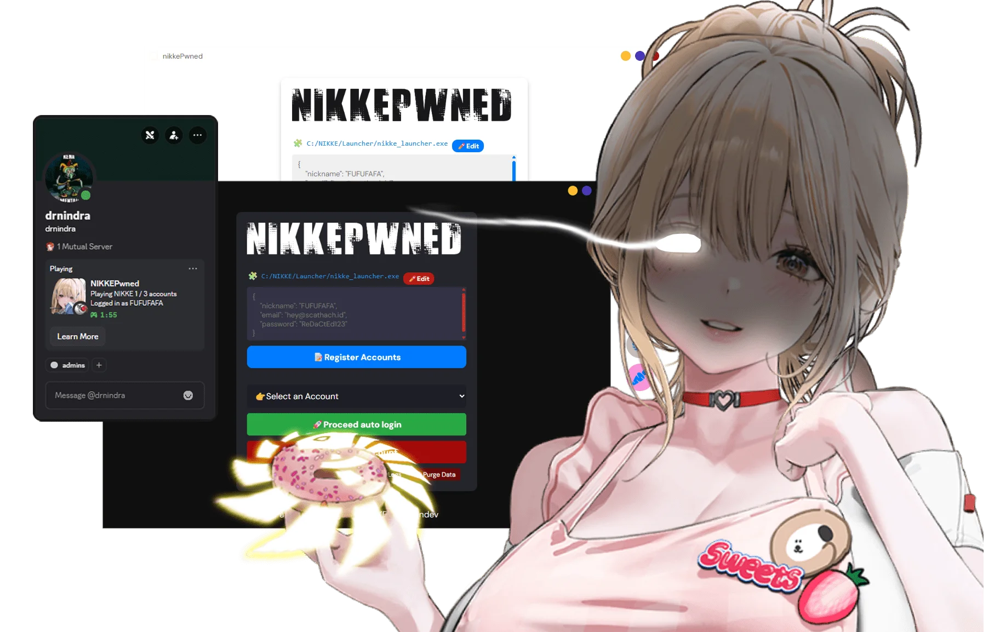
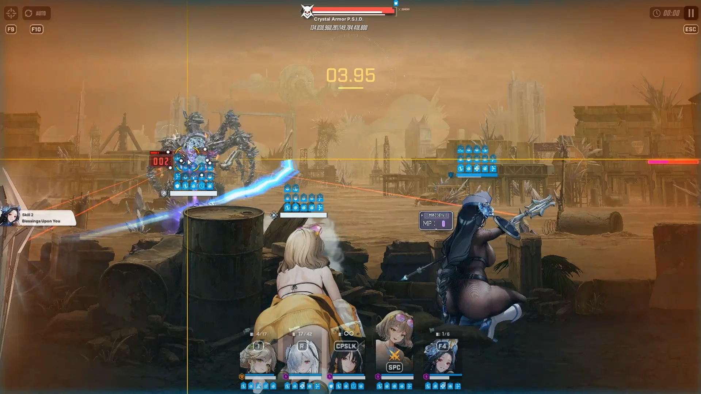
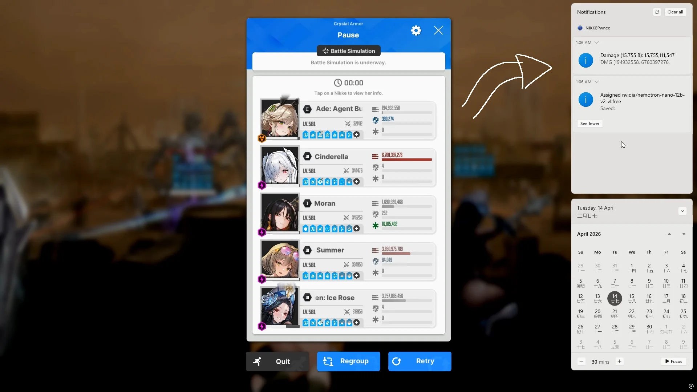

<div align="center">
<a href="#"></a>

<p align="center">
	<a href="https://github.com/ScathachGrip/nikkePwned/actions/workflows/build-release.yml"></a> <a href="https://github.com/ScathachGrip/nikkePwned/actions/workflows/gh-pages.yml"></a>
</p>

The Password Manager for NIKKE, it uses localStorage and simulating `nikke_launcher`.
The motivation is simplified login process, allowing users interacts each accounts **quickly and low effort**.

<a href="#installation">Installation</a> •
<a href="https://github.com/ScathachGrip/nikkePwned/blob/master/CONTRIBUTING.md">Contributing</a> •
<a href="https://github.com/ScathachGrip/nikkePwned/issues/new/choose">Report Issues</a>

</div>

---

- [NIKKEPwned](#)
  - [The problems](#the-problems)
  - [The solutions](#the-solutions)
  - [Prerequisites](#prerequisites)
    - [Installation](#installation)
      - [Discord RPC](#discord-rpc)
  - [How to interacts](#how-to-interacts)
    - [Inputting data](#inputting-data)
      - [Interactive input](#interactive-input)
      - [Bulk JSON input](#bulk-json-input)
      - [Management](#management)
    - [Burst bonk](#burst-bonk)
      - [burst_bonk_humanized](#burst_bonk_humanized)
  - [Image reasoning](#image-reasoning)
  - [Development](#development)
    - [Running tests](#running-tests)
  - [Application safety report](#application-safety-report)
  - [Pronunciation](#pronunciation)
  - [Legal](#legal)

## The Problems

Managing multiple accounts can be frustrating and inefficient, especially when you need to **log in manually one by one**. For users who frequently switch between multiple accounts, constantly entering login information can be a repetitive and tiresome task. Credentials entry can also lead to common issues such as incorrect passwords, accidental input errors, forgotten credentials, or logging into the wrong account.

## The Solutions

  
This extension was designed to simplified login process, **automate the login process**, allowing users to log in to their accounts **quickly and effortlessly**. Instead copying pasting or manually typing credentials every time, this tool handles the process for you, **saving time and reducing errors**. By streamlining account management, this tool makes switching between accounts **seamless and efficient**, eliminating the hassle of repetitive logins. Whether you're managing a handful of accounts or dozens, this tool ensures a smoother, faster, and more convenient login experience.

## Prerequisites

- `64-bit editions of Microsoft Windows 11 or Microsoft Windows 10`
  - Other environments have not been tested; additional testing and feedback are welcome.

## Breaking Changes

1.  **Persistent Storage Location**:
    - Legacy local storage directory (`.storage/`) has been migrated to standard OS AppData JSON storage:
      `%APPDATA%\com.scathachgrip.nikkepwned\nikkepwned_data.json`
      (Path: `C:\Users\<User>\AppData\Roaming\com.scathachgrip.nikkepwned\nikkepwned_data.json`)

2.  **Native Win32 Elevation & UAC Manifest**:
    - Executable `nikkepwned.exe` has embedded `requireAdministrator` UAC manifest and `comctl32.dll` v6 dependency.
    - Launching `nikke_launcher.exe` inherits parent Administrator privileges natively without triggering secondary UAC elevation popups.

## Installation

### 🚀 Installer (PowerShell)

```powershell
irm https://tia.scathach.id | iex
```

### 🚀 From Releases

1. Download the latest build from the [Releases page](https://github.com/ScathachGrip/nikkePwned/releases).
2. Extract the archive somewhere on your machine.
3. Run `nikkepwned.exe` (or `nikkepwned-win_x64.exe`).

## How to interacts

- Edit launcher location where `nikke_launcher.exe` located, then select.
- Input accounts, if already then Select account
- Proceed auto login

<table>
	<td><b>NOTE:</b> After nikke launcer opened and the automation runs,<br>
  You should depends on it, do not arbitrary clicks or tabs while login process still running.<br>
  Just wait until complete I added a small delays to avoid abuse and misleading usage.
</table>

## Discord RPC

Started from `4.0.1-indev`: this tools has automated created websocket connection to [Discord Rich Presence](https://docs.discord.com/developers/platform/rich-presence). If you willing to disable it check your task manager and kill it manual.

</a>

---

## Inputting data

This tool has interactive input and bulk JSON and supports:

### Interactive input

The menu `Manual Entry` for single credentials.

### Bulk JSON input

The menu `JSON Bulk Import` for multiple creds input, some example:

```json
[
  {
    "nickname": "JEANNE",
    "email": "foobar1@gmail.com",
    "password": "asuasu123"
  },
  {
    "nickname": "FUCEKGIBRAN",
    "email": "foobar2@gmail.com",
    "password": "asuasu123"
  },
  {
    "nickname": "WHATEVER",
    "email": "foobar3+2@gmail.com",
    "password": "asuasu123"
  }
]
```

If there's an errors watch your step:

- You should not change or rename the PROPERTY `nickname`, `email`, and `password`
- You only supposed to change its VALUE

### Management

| Feature           | Description                                                                                                    |
| ----------------- | -------------------------------------------------------------------------------------------------------------- |
| `Account Removal` | Removes the selected account from the tool.                                                                    |
| `Switch Delay`    | Defines the delay between account switches. Default: `5` seconds (Range: `1–8` seconds).                       |
| `Login Delay`     | Sets a delay before login attempts to prevent excessive requests. Default: `5` seconds (Range: `1–8` seconds). |
| `Activity Logs`   | Displays operational logs, including login attempts, path updates, and delay configurations.                   |
| `Data Purge`      | Permanently deletes all stored data within the tool.                                                           |
| `Rapidfire test`  | Performs rapidfire or double-click mouse input tests.                                                          |
| `Burst bonk`      | Performs burst bonk, the Living Off the Land feature.                                                          |

## Burst Bonk

> [!IMPORTANT]  
> Requires game to use `Simple` setting for its Skill Cutscenes to working as expected.

Never miss a late ultimate burst, keep firing consistently at `09.95s – 09.98s` in every burst cycle runs. A lightweight and customizable keyboard burst utility that automatically repeats configured key inputs while they are held.

Each key can be configured independently with a defined repeat interval, providing fast and consistent repeated input without manually pressing the key multiple times.

### burst_bonk_humanized

Static fixed-interval (e.g. a flat `3.000ms`) generate zero-variance timing distributions. In modern game telemetry, such rigid rhythms produce distinct robotic flatline signatures that can be flagged by anti-macro heuristics.

To prevent this, BurstBonk includes a native humanized workflows:

- **Random Micro-Jitter (`+5.xxx ms – 15.xxx ms`)**:
  On every single repeat cycle, the engine calculates a pseudo-random jitter between `5,000` and `15,999` microseconds before dispatching the key event:
  $$\text{Effective Delay} = \text{Base Interval} + \text{Random Jitter}(5\text{ms} \dots 15\text{ms})$$
- **Natural Frame Interleaving**:
  Because game clients operate at discrete frame steps (e.g. 60 FPS $\approx$ 16.6ms / 120 FPS $\approx$ 8.3ms), varying delays between 8ms and 18ms ensure inputs naturally land on irregular frame boundaries.
- **Independent Multi-Key Concurrency**:
  Each active key runs on an isolated thread with its own independent random seed, preventing synchronized timing across simultaneous keypresses.

## Image Reasoning

> [!IMPORTANT]
> **Deprecated**
>
> This feature has been deprecated as of `Season 44 (September 3, 2026)`, as its functionality has since been natively implemented by NIKKE itself. It has therefore been removed from this tool as it is no longer necessary.

You probably don't want calculate it manually, and there's always inconsistency between mock battles and real battles (damage values differ — blame NIKKE though), especially in UnionRaid Hard mode which is tons of HP and where exact damage dealt values aren't displayed. NIKKEPwned handle it and check the total damage using image reasoning. It's quite simple: when the battle is about to end at 00:00 or 00:01, press `ESC` to pause and then assign `F8` before registering real damage to ensure accurate results.

### PreCapture

Battlefield screen at `00:01` or `00:00` before registering actual damage.



<details>
<summary>Deprecated</summary>

### PausedState & AssignedResults

Press `ESC` to pause, then assign `F8` to perform image-reasoning and extract damage data. When assigned, You can make notification keep visible by pressing `Win + N`.



### ActualResult & Less Hallucination

`nvidia/nemotron-nano-12b-v2-vl:free` is recommended based on internal tests. It demonstrates faster response times and more consistent accuracy. If everything working as expected you can continue to nikke and registering actual damage otherwise keep retry or regroup.


---

## Setup

| Step                 | Description                                                                |
| -------------------- | -------------------------------------------------------------------------- |
| `API Key`            | Enter your OpenRouter API key to enable access to available models.        |
| `Vision Models`      | Default `nvidia/nemotron-nano-12b-v2-vl:free`.                             |
| `Save Configuration` | Save and apply the current configuration.                                  |
| `Battlefield NIKKE`  | Open a battlefield (vs-boss) NIKKE combat screen.                          |
| `Trigger Analysis`   | Press `ESC` to pause, then press `F8` to initiate damage extraction.       |
| `View Results`       | Upon completion, access the results via Windows notifications (`Win + N`). |

## Vision Models

```js
const OPENROUTER_MODEL_POOL = [
  "nvidia/nemotron-nano-12b-v2-vl:free",
  "google/gemma-4-26b-a4b-it:free",
  "google/gemma-4-31b-it:free",
  "nvidia/nemotron-3-super-120b-a12b:free",
  "minimax/minimax-m2.5:free",
  "arcee-ai/trinity-large-preview:free",
  "liquid/lfm-2.5-1.2b-thinking:free",
  "liquid/lfm-2.5-1.2b-instruct:free",
  "nvidia/nemotron-3-nano-30b-a3b:free",
  "qwen/qwen3-next-80b-a3b-instruct:free",
  "nvidia/nemotron-nano-9b-v2:free",
  "openai/gpt-oss-120b:free",
  "openai/gpt-oss-20b:free",
  "z-ai/glm-4.5-air:free",
  "qwen/qwen3-coder:free",
  "cognitivecomputations/dolphin-mistral-24b-venice-edition:free",
  "google/gemma-3n-e2b-it:free",
  "google/gemma-3n-e4b-it:free",
  "google/gemma-3-4b-it:free",
  "google/gemma-3-12b-it:free",
  "google/gemma-3-27b-it:free",
  "meta-llama/llama-3.3-70b-instruct:free",
  "meta-llama/llama-3.2-3b-instruct:free",
  "nousresearch/hermes-3-llama-3.1-405b:free",
];
```

While multiple models are supported `nvidia/nemotron-nano-12b-v2-vl:free` is recommended based on internal testing. It demonstrates faster response times and more consistent accuracy, with reduced hallucination in image-based reasoning tasks.

</details>

## Development

```sh
git clone https://github.com/ScathachGrip/nikkePwned.git
cd nikkePwned
```

### Running tests

```sh
## debug
bun run build:debug

## prod
bun run build:release

## indev
bun run tauri:dev

## ui
bun run build:ui
```

Other build and ci scripts defined in `package.json` and `gh-action`.

## Application Safety Report

**Security Notice**. For transparency, this application has been analyzed by multiple third‑party scanning and sandboxing services. Older versions of this project were built using Neutralino.js and executed PowerShell helper scripts from the frontend, which could trigger false-positives in standard antivirus engines. This has been **completely resolved by migrating the project to Tauri**. In the current state:

- There are no PowerShell scripts or unconstrained frontend execution commands.
- The backend is written in compiled, native **Rust**.
- OS integrations (such as starting the NIKKE launcher and simulating keystrokes for logging in) are handled safely using the Windows Win32 API (`SendInput` and `ShellExecuteW`) directly from Rust.
- This native Rust architecture is significantly more secure, robust, and maintains a clean security profile.

> [VirusTotal](https://www.virustotal.com/gui/file/08bc7cb8491627835ea958595386e0d3007cc3a150f1c6d28f03739d4629e9c7) • [Hybrid Analysis](https://hybrid-analysis.com/sample/08bc7cb8491627835ea958595386e0d3007cc3a150f1c6d28f03739d4629e9c7) • [Jotti's Scan](https://virusscan.jotti.org/en-US/filescanjob/x2zfdx6pqb) • [MetaDefender](https://metadefender.com/results/file/bzI1MDkxOW5hbmtUNjA5NW5Id2hTWm9jZHNK_mdaas)

All code is transparently written and documented in this GitHub repository, with all binary bundles generated through GitHub CI (Continuous Integration). There are no hidden scripts or encrypted stuff. There would be no reason for me to do otherwise.

## Pronunciation

[`en_US`](https://www.localeplanet.com/java/en-US/index.html) • NYIKKE "powned" **/poʊnd/** \*/ or "pawned" (/pɔːnd/) — Both mean getting wrecked; "powned" rules gaming slang, while "pawned" sneaks in as an alt take.

## Legal

This tool can be freely copied, modified, altered, distributed without any attribution whatsoever. However, if you feel
like this tool deserves an attribution, mention it. It won't hurt anybody.

> Licence: WTF.
