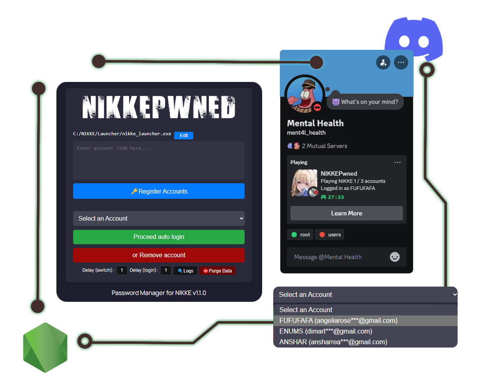

<div align="center">
<a href="#"></a>


<p align="center">
	<a href="https://github.com/ScathachGrip/nikkePwned/actions/workflows/build.yml"></a>
	<a href="https://github.com/ScathachGrip/nikkePwned/actions/workflows/build-rpc.yml"></a>
</p>

NIKKEPwned is a Password Manager for NIKKE, it uses localStorage and simulating nikke_launcher  
The motivation of this project is simplified login process, allowing users interacts each accounts **quickly and effortlessly**.

<a href="#installation">Installation</a> •
<a href="https://github.com/ScathachGrip/nikkePwned/blob/master/CONTRIBUTING.md">Contributing</a> •
<a href="https://github.com/ScathachGrip/nikkePwned/issues/new/choose">Report Issues</a>
</div>

---

- [NIKKEPwned](#)
  - [The problem](#the-problem)
  - [The solution](#the-solution)
  - [Prerequisites](#prerequisites)
    - [Installation](#installation)
      - [How to interacts](#how-to-interacts)
      - [Inputing data](#inputing-data)
      - [Discord RPC support](#discord-rpc-supports)
    - [Manual build](#manual-build)
    - [Running tests](#running-tests)
  - [Limitations](./LIMITATIONS.md)
    - [Prevent antivirus things](./LIMITATIONS.md#prevent-windows-defender-from-flagging-the-tool)
    - [Tool flagged as potential malware](./LIMITATIONS.md#this-tool-flagged-as-potential-malware)
  - [Frequently asked questions ](#frequently-asked-questions)
  - [Pronunciation](#Pronunciation)
  - [Acknowledgements](./CLOSING_REMARKS.md)
  - [Legal](#legal)

# The Problem  
Managing multiple accounts can be frustrating and inefficient, especially when you need to **log in manually one by one**. For users who frequently switch between multiple accounts, constantly entering login information can be a repetitive and tiresome task.  

# The Solution  
This extension was designed to simplified login process, **automate the login process**, allowing users to log in to their accounts **quickly and effortlessly**. Instead copying pasting or manually typing credentials every time, this tool handles the process for you, **saving time and reducing errors**. By streamlining account management, this tool makes switching between accounts **seamless and efficient**, eliminating the hassle of repetitive logins. Whether you're managing a handful of accounts or dozens, this tool ensures a smoother, faster, and more convenient login experience. 


## Prerequisites
- Windows 11 & Windows 10 64bit
- You should turn-off antivirus
  - You should do some exception things or exclusion 
    - (if your antivirus scanning this tool however)
  - Read more: [this tool flagged as potential malware](./LIMITATIONS.md#this-tool-flagged-as-potential-malware)

# Installation
- Get the latest build version from the [release page You only need nikkepwned-release.zip.](https://github.com/ScathachGrip/nikkePwned/releases) 
- Unzip it, or extract it "as folder" somewhere in your computer
- Open `nikkepwned-win_x64.exe` with **Run as Administrator**
  - Read more: [LIMITATIONS.md](./LIMITATIONS.md#this-tool-flagged-as-potential-malware) for explanation.  

# How to interacts
>  1. Edit launcher location where `nikke_launcher.exe` located, then select.
>  2. Input accounts as JSON
>  3. If success then select corresponding account
>  4. Proceed auto login
<table>
	<td><b>NOTE:</b> After nikke launcer opened and the automation runs,<br>
  You should depends on it, do not arbitrary clicks or tabs while login process still running.<br>
  Just wait until complete I added a small delays to avoid abuse and misleading usage.
</table>

## Discord RPC supports
**OPTIONAL**: this tools has DISCORD rich presence support if you like to..  
Just open `discord-rpc.exe` BEFORE `nikkepwned-win_x64.exe` for realtime state checks.  

</a>

## Inputing data
This tool uses JSON and supports **two types of input** here's the example:

🟢 Single Input (Object Format)  
Use this format when inputting one by one account:  
```json
{
  "nickname": "FUFUFAFA",
  "email": "foobar1@gmail.com",
  "password": "asuasu123"
}
```

🔵 Multiple Input (Array Format)  
Use this format when inputting multiple accounts at once:
```json
[
  {
    "nickname": "FUFUFAFA",
    "email": "foobar1@gmail.com",
    "password": "asuasu123"
  },
  {
    "nickname": "FUCEKGIBRAN",
    "email": "foobar2@gmail.com",
    "password": "asuasu123"
  },
  {
    "nickname": "WHATEVER",
    "email": "foobar3+2@gmail.com",
    "password": "asuasu123"
  }
]
```
If there's an errors watch your step again then..  
You should not change or rename the PROPERTY `nickname`, `email`, and `password`  
You only supposed to change its VALUE
> All good, then you can click "Register Accounts"

## Manual build
<table>
	<td><b>NOTE:</b> NodeJS 20.x or higher</td>
</table>


If you prefer to build the project manually, follow these steps:  
```sh
git clone https://github.com/ScathachGrip/nikkePwned.git
cd nikkePwned
```
You can check build script on `package.json` for the step by step.

## Running tests
> Check workflows and the whole build script on  `package.json`

## Limitations
This tool must be `run as Administrator` to function correctly because:
- It **simulates keystrokes**, which requires elevated permissions.
- Opening NIKKE launcher triggers **User Account Control (UAC) prompt** otherwise the automation will broke

> Read more: [LIMITATIONS.md for clearly explanation.](./LIMITATIONS.md)

## Frequently asked questions 
**Q: Is this safe?**  
> Yes, my code is fully transparent, I even write it with sweet and readable COMMENTS to make more casual or entry level can understand. You can check the source yourself—take a look at [app.ts](./src/app.ts) and [discord-rpc.cjs](./discord-rpc.cjs). There are no hidden scripts or anything suspicious.

**Q: I’m still unsure. Do I have to use it?**   
> I completely understand your concern. Here’s a simple way to decide:
- **You can** if you value simplicity and convenience.
- **Avoid it** ~~If you FOMO~~ if you security concerns outweigh your need for ease of use.

All code is transparently written and documented in this GitHub repository, with all binary bundles generated through GitHub CI (Continuous Integration). There are no hidden scripts or encrypted stuff. There would be no reason for me to do otherwise.

## Pronunciation
[`en_US`](https://www.localeplanet.com/java/en-US/index.html) • NYIKKE "powned" **/poʊnd/** */ or "pawned" (/pɔːnd/) — Both mean getting wrecked; "powned" rules gaming slang, while "pawned" sneaks in as an alt take.

## Legal
This tool can be freely copied, modified, altered, distributed without any attribution whatsoever. However, if you feel
like this tool deserves an attribution, mention it. It won't hurt anybody.
> Licence: WTF.